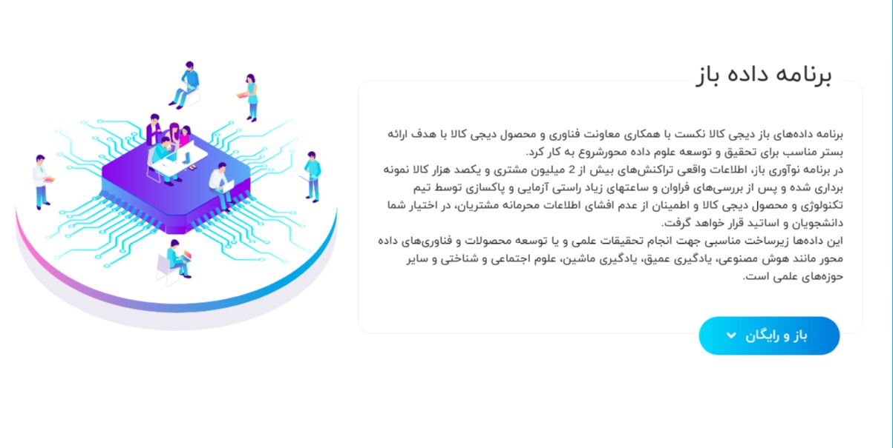
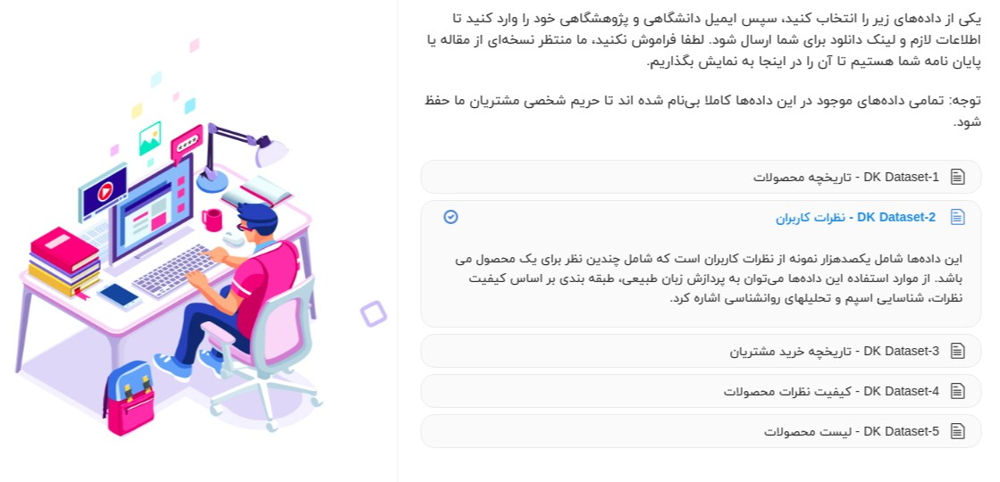

# Description

[Digikala](https://www.digikala.com/) online market has recently published some open source data in various categories.

Since I always wanted to do some NLP project, then I thought of some useful tutorials in python for newcomers.
I really hope this could be useful for you guys.

I still keep updating the package and also will share the link of video and article related to this post soon!

## If you like the content
If you like the content, just add a star. :sunglasses:

### Before you run models

First you should run the 0 - data Wrangling.ipynb to preprocess the data before going for the rest of files and creating your models.

## Requirements

Use these conda commands to install the packages in environment:

`conda install -c conda-forge --file requirements.txt`

## Dataset

I used mini-version of digikala customers comment dataset from www.quera.ir 
which was uploaded for a AI competetion on 1398/08/16 and can be found [here](https://quera.ir/course/assignments/10668/problems).

(Of course Needs authentication).

Full version available in these links: 

[source 1](https://www.digikala.com/opendata/#section-4)

[Source 2](https://www.digikala.com/static/files/46688ac5.xlsx)

## For more studies:

for text preprocessing:

https://www.kaggle.com/sudalairajkumar/getting-started-with-text-preprocessing
https://www.kaggle.com/kernels/scriptcontent/19201884/download

tfidf:

https://towardsdatascience.com/multi-label-text-classification-with-scikit-learn-30714b7819c5
https://kavita-ganesan.com/tfidftransformer-tfidfvectorizer-usage-differences/#.Xc3OG67ngRY

basic word2vec:

https://medium.com/explore-artificial-intelligence/word2vec-a-baby-step-in-deep-learning-but-a-giant-leap-towards-natural-language-processing-40fe4e8602ba

gensim:

https://towardsdatascience.com/machine-learning-word-embedding-sentiment-classification-using-keras-b83c28087456

keras with gensim:

https://www.depends-on-the-definition.com/guide-to-word-vectors-with-gensim-and-keras/

LSTM:

https://medium.com/free-code-camp/applied-introduction-to-lstms-for-text-generation-380158b29fb3

